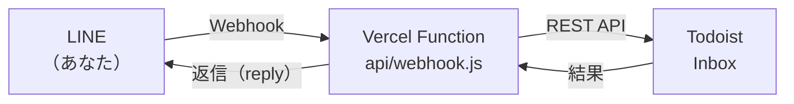

# line-todoist-inbox

LINEに送るだけでTodoistのInboxにタスクが入る、個人用ボット。

> **非公式プロジェクトです。** Todoist（Doist社）およびLINE（LINEヤフー株式会社 / LY Corporation）とは一切関係がなく、両社による承認・提供を受けたものではありません。「Todoist」「LINE」は各社の商標です。

思いついたことを、いつも開いているLINEのトークに送るだけ。振り分けやラベル付けはボットでは行わず、とにかく取りこぼさずInboxへ入れることに徹しています（整理はTodoist側で、または任意で[AIのルーティン](#aiと組み合わせる任意)に任せられます）。

[English](#english)

---

## 目次

- [特徴](#特徴)
- [費用](#費用)
- [仕組み](#仕組み)
- [セットアップ](#セットアップ)
- [設定（環境変数）](#設定環境変数)
- [リッチメニュー](#リッチメニュー)
- [AIと組み合わせる（任意）](#aiと組み合わせる任意)
- [制限・既知の挙動](#制限既知の挙動)
- [セキュリティ](#セキュリティ)
- [開発](#開発)
- [サポートについて](#サポートについて)
- [ライセンス](#ライセンス)

## 特徴

以下の返信例は既定の標準語スタイル（`REPLY_STYLE=standard`）のものです。

### 1件だけ送る

1行目がタスク名、2行目以降はタスクのコメントになります。

```
見積もりを送る
先月と同じ金額で
```
```
✅ 1件追加しました
① 見積もりを送る
```

### 箇条書きでまとめて送る

行頭に「・」「-」「1.」「①」などを付けた行が1件ずつのタスクになります（1回15件まで）。

- 記号の無い行は、直前の項目のコメントになります
- 最初の記号付きの行より前に書いた行は「見出し」として、全項目に「見出し：〇〇」というコメントで付きます

```
週末の買い物
・牛乳
・卵
・洗剤
  詰め替え用
```
```
✅ 3件追加しました
① 牛乳
② 卵
③ 洗剤
```

### メモ

先頭に「メモ」と書くと、チェック欄の無い（完了できない）メモとして入ります。Todoistでは「* 」で始まるタイトルとして保存されます。

```
メモ：駅前のパン屋は月曜定休
```

### 日付（自然な言葉で）

Todoistのクイック追加と同じ仕組みで、「明日」「金曜」「10/15 14時」などの日付が予定日になります。

```
明日 歯医者の予約を取る
```

### 日付だけ後から送る

タスクを登録した後に「明日7:00」「金曜」「10/15 14時」のような日付・時刻だけの文を送ると、新しいタスクは作らず、直前に登録したタスクの日時を変更します。

- 直前15分以内に追加したタスクが対象です
- 直前の送信で追加したのがちょうど1件のときだけ動きます（複数件まとめて送った直後は、どれのことか判断できないため変更しません）
- 日付以外の言葉が入っていれば、通常のタスクとして登録されます

```
請求書を確認する
```
```
明日7:00
```
```
📅「請求書を確認する」を 10/7 07:00 にしました
```

### URL

URLを送ると、ページのタイトルを取得して「読む：〈ページタイトル〉」というタスクにし、URLはコメントに残します。文章と一緒に送った場合は、その文章がタスク名になります。

```
https://example.com/article
```
```
✅ 1件追加しました
① 読む：Example Domain
```

### 写真

写真はTodoistのコメントの添付ファイルとして保存されます。

- 文章（1件だけのもの）を送ってから2分以内に写真を送ると、そのタスクに添付されます
- 写真を送ってから2分以内に文章（1件だけのもの）を送ると、その文章のタスクに写真がまとめられます
- 写真だけを送ると「📷 写真（日時）」というタスクになります
- 複数枚まとめて送った写真は1つのタスクにまとまります
- 箇条書きで複数件を送った場合は、どのタスクの写真か判断できないため添付しません

### 一覧（今日のタスク）

「一覧」または「今日」と送ると、今日のタスクと期限切れのタスクをカード形式で返します（優先度順、最大20件、メモは除く）。

- 各タスクに［完了］［明日へ］ボタンが付き、LINEから直接操作できます
- 繰り返しタスクは、繰り返し設定を壊さないよう［完了］だけが付きます
- 一覧を表示した後に期日が変わったタスクのボタンを押しても、何もしません（古いボタンの誤操作・二重押し対策）
- カードが送れなかった場合は、文字の一覧で返します

### 登録直後のボタン

1件だけ登録したときは、返信の下に［キャンセル］［今日］［明日］［p1］［p2］のクイックリプライボタンが出ます。複数件のときは［キャンセル］だけです。

### 取り消し

「キャンセル」または「取消」と送ると、15分以内に追加した直前の送信分をまとめて取り消します。

### その他

- 「使い方」と送ると、使い方を返します
- 音声・動画・ファイルは未対応です。送ると「未対応です」という案内を返します
- 許可リストに登録したLINEユーザー（あなた本人）以外からのメッセージは無視します

## 費用

個人で使う範囲なら、**0円で運用できます**。

| 項目 | 費用 | 補足 |
| --- | --- | --- |
| LINE公式アカウント | 無料 | このボットは応答メッセージ（reply）しか使いません。応答メッセージは無料で、無料プランの月間メッセージ数の上限にも数えられません |
| Vercel | 無料 | Hobbyプラン（個人・非商用向け）で動きます |
| Todoist API | 無料 | Todoistのアカウントがあれば使えます |
| AI API | なし | ボット本体はAIを一切使っていません |

> **Todoistのプランについて：** 写真の添付やコメントなど、Todoistのプランによっては使えない機能があります。写真やコメントがうまく保存されない場合は、ご自身のTodoistのプランで該当機能が使えるか確認してください（Todoist Proで動作を確認しています）。

各サービスの料金・プラン内容は変更されることがあります。最新の情報は各サービスの公式サイトで確認してください。

## 仕組み



1. LINE公式アカウントに送ったメッセージが、Webhookで Vercel のサーバーレス関数（`api/webhook.js`）に届きます
2. 関数が署名を検証し、許可されたユーザーかを確認してから、メッセージを解析してTodoist APIでInboxにタスクを追加します
3. 結果をLINEの応答メッセージで返します

データベースは使っていません。「取り消し」や「日付だけ後から送る」は、Inboxにあるタスクの追加時刻から直前の送信分を判断しています。

## セットアップ

必要なもの：LINEアカウント、Todoistアカウント、Vercelアカウント（GitHubアカウントでのサインアップが簡単です）。

### 1. LINE公式アカウントを作り、Messaging APIを有効にする

2024年9月以降、LINE DevelopersコンソールからMessaging APIチャネルを直接作ることはできなくなりました。先にLINE公式アカウントを作り、そこからMessaging APIを有効にします。

1. https://entry.line.biz/ からLINE公式アカウントを作成します（未認証アカウントで構いません）
2. [LINE Official Account Manager](https://manager.line.biz/) で作成したアカウントを開き、「設定」→「Messaging API」→「Messaging APIを利用する」を押します
3. プロバイダーを選択または新規作成します（名前は自由です）。プライバシーポリシーと利用規約のURLは空欄で構いません
4. [LINE Developersコンソール](https://developers.line.biz/console/) で同じプロバイダー → チャネルを開き、次の2つを控えます
   - 「チャネル基本設定」タブの **チャネルシークレット（Channel secret）**
   - 「Messaging API設定」タブの **チャネルアクセストークン（長期）**（「発行」を押して作成）
5. LINE Official Account Managerの「設定」→「応答設定」で、「チャット」と「応答メッセージ」をオフにします（Webhookはデプロイ後に設定します）

### 2. TodoistのAPIトークンを取得する

Todoistの「設定」→「連携機能」→「開発者」タブにある **APIトークン** をコピーします。

### 3. Vercelにデプロイする

下のボタンを押すと、このリポジトリがあなたのGitHubにコピーされ、Vercelにデプロイされます。途中で3つの環境変数を聞かれるので、手順1・2で控えた値を入力します。

[](https://vercel.com/new/clone?repository-url=https%3A%2F%2Fgithub.com%2Fhk1226%2Fline-todoist-inbox&env=LINE_CHANNEL_SECRET,LINE_CHANNEL_ACCESS_TOKEN,TODOIST_API_TOKEN&envDescription=LINE%E3%81%A8Todoist%E3%81%AE%E9%8D%B5&project-name=line-todoist-inbox)

| 環境変数 | 入れる値 |
| --- | --- |
| `LINE_CHANNEL_SECRET` | チャネルシークレット |
| `LINE_CHANNEL_ACCESS_TOKEN` | チャネルアクセストークン（長期） |
| `TODOIST_API_TOKEN` | TodoistのAPIトークン |

ボタンを使わずに、リポジトリをフォークしてVercelの「Add New → Project」からインポートしても構いません。その場合は Settings → Environment Variables に上の3つを登録してから再デプロイしてください。

> **ヒント：** GitHubへのpushで自動デプロイする場合、コミットの作成者（author）のメールアドレスがVercel／GitHubのアカウントに紐づいていないと、Vercelがデプロイを拒否することがあります。デプロイが始まらないときは `git config user.email` を確認してください。

### 4. LINEとつなぐ

1. LINE Developersコンソールの「Messaging API設定」→「Webhook URL」に次のURLを入れ、「検証」を押して成功を確認します

   ```
   https://<プロジェクト名>.vercel.app/api/webhook
   ```

2. 「Webhookの利用」をオンにします
3. 同じ画面のQRコードから、作成した公式アカウントを友だち追加します

### 5. 自分だけが使えるようにする（許可リスト）

1. ボットに何かメッセージを送ると、あなたのLINEユーザーIDが返ってきます。この時点は「初期設定モード」で、タスクは追加されません
2. 返ってきたIDを、Vercelの環境変数 `ALLOWED_LINE_USER_ID` に登録します
3. Vercelで再デプロイします（環境変数の変更は再デプロイ後に反映されます）
4. もう一度メッセージを送り、「✅ 1件追加しました」という返信が来れば完成です

## 設定（環境変数）

| 名前 | 必須 | 説明 |
| --- | --- | --- |
| `LINE_CHANNEL_SECRET` | 必須 | LINEのチャネルシークレット。Webhookの署名検証に使います |
| `LINE_CHANNEL_ACCESS_TOKEN` | 必須 | LINEのチャネルアクセストークン（長期）。返信と写真の取得に使います |
| `TODOIST_API_TOKEN` | 必須 | TodoistのAPIトークン |
| `ALLOWED_LINE_USER_ID` | 必須 | 使ってよいLINEユーザーID。未設定の間は初期設定モードになり、最初のメッセージにあなたのIDを返します |
| `REPLY_STYLE` | 任意 | 返信の口調。`standard`＝標準語（既定）／`hakata`＝博多弁 |
| `TIMEZONE` | 任意 | 一覧の表示や写真タスクの日時に使うタイムゾーン。既定は `Asia/Tokyo` |

ローカルで使う場合の雛形は [`.env.example`](.env.example) にあります。

## リッチメニュー

トーク画面の下に［一覧］［キャンセル］［使い方］のボタンを出すと便利です。画像は [`assets/richmenu.png`](assets/richmenu.png)（2500×843px、3分割）を用意しています。

1. LINE Official Account Managerの「ホーム」→ 左メニューの「リッチメニュー」→「作成」
2. 表示期間を長めに設定し、メニューバーのテキストを「メニュー」などにします
3. 「テンプレートを選択」で、**小**サイズの3分割テンプレートを選びます
4. 「画像を作成」ではなく「画像をアップロード」で `assets/richmenu.png` を選びます
5. A・B・Cのアクションをそれぞれ「テキスト」にし、「一覧」「キャンセル」「使い方」と入力します
6. 保存すると、トーク画面の下にメニューが表示されます

## AIと組み合わせる（任意）

ボット本体はAIを一切使っていません。Inboxに入れるところまでが役目です。

Inboxの整理（プロジェクトへの振り分け、ラベル付け、写真タスクの名前付けなど）を自動化したい場合は、[Claude Code](https://claude.ai/code) のクラウドルーティン（[https://claude.ai/code/routines](https://claude.ai/code/routines) で作る定期実行エージェント）と、Todoistコネクタを組み合わせる方法があります。サーバーを用意する必要はなく、プロンプトを貼り付けてスケジュールを決めるだけです。

そのまま使えるプロンプト例を [`docs/recipes/`](docs/recipes/) にまとめています。

| レシピ | 内容 |
| --- | --- |
| [Inbox自動整理](docs/recipes/inbox-triage.md) | 1日3回、Inboxのタスクをプロジェクト・ラベル・所要時間で振り分け |
| [朝のブリーフィング](docs/recipes/morning-briefing.md) | 今日やるべきことをスマホに通知（読み取り専用） |
| [夕方のリマインド](docs/recipes/evening-reminder.md) | 18時に、今日中のタスクの残りを通知（読み取り専用） |
| [週次レビュー](docs/recipes/weekly-review.md) | 日曜の夜に、1週間の振り返りと来週の見通しを通知（読み取り専用） |

ルーティンの実行はClaudeのプランの利用枠を消費します。このボットの動作自体には影響しません。

## 制限・既知の挙動

- 日付の解釈はTodoistに任せています。たとえば「来週月曜」が、再来週の月曜として解釈されることがあります。登録後の返信に表示される日付を確認してください
- 「キャンセル」と「日付だけ後から送る」は、15分以内に追加したタスクで、かつまだInboxに残っているものだけが対象です（整理されて別のプロジェクトに移ったタスクは対象外です）
- 写真が文章のタスクにまとまるのは、1件だけのメッセージの場合だけです
- 動画・音声・ファイルは未対応です
- 1人で使うことを前提に設計しています（許可できるLINEユーザーは1人です）

## セキュリティ

- LINEから届くすべてのWebhookについて、チャネルシークレットで署名を検証し、正しくないリクエストは拒否します
- 許可リスト（`ALLOWED_LINE_USER_ID`）に登録した本人以外からのメッセージは無視します
- TodoistのAPIトークンは、あなたのTodoistのすべてのデータを読み書きできます。Vercelの環境変数にだけ保存し、コードやリポジトリ、チャットなどには絶対に書かないでください。漏れた可能性がある場合は、Todoistの設定からトークンを再発行してください
- URLのタイトル取得では、プライベートネットワークや内部向けのアドレスへのアクセスを拒否します

## 開発

Node.js 20以上で動きます。依存パッケージはありません（`npm install` は不要です）。

```bash
npm test
```

```
api/
  webhook.js     LINEのWebhookを受け取る入口。署名検証、許可リスト、メッセージ種別ごとの振り分け
lib/
  parse.js       メッセージの解析（コマンド判定、箇条書きの分割、メモ、見出し）
  todoist.js     Todoist APIの呼び出し（追加、更新、完了、取り消し、Inboxの取得）
  list.js        「一覧」の文字版とカード（Flex Message）版の組み立て
  actions.js     ボタン（完了／明日へ／今日／p1／p2）の処理とクイックリプライ
  dateonly.js    日付だけのメッセージの判定と、直前のタスクへの日時の適用
  photo.js       写真の取得とTodoistへの添付、文章タスクとのまとめ
  url.js         URLからページタイトルを取得して「読む：〇〇」にする
test/            node:test によるテスト
assets/          リッチメニュー画像
docs/recipes/    AIルーティンのプロンプト例
```

## サポートについて

個人用に作ったものを、そのまま公開しています。IssueやPull Requestは歓迎しますが、対応や回答を保証するものではありません。ご自身の責任でお使いください。

## ライセンス

[MIT License](LICENSE)

---

## English

**line-todoist-inbox** is a small, personal LINE bot that adds whatever you send to a LINE Official Account straight into your Todoist Inbox. It runs as a single Vercel serverless function with no dependencies and no database.

> **Unofficial.** This project is not affiliated with, endorsed by, or sponsored by Doist (Todoist) or LY Corporation (LINE). "Todoist" and "LINE" are trademarks of their respective owners.

### Features

- One message becomes one task; extra lines become a comment
- Bulleted lists (`・`, `-`, `1.`, `①` …) become multiple tasks (up to 15); a leading heading line is added to every item as a comment
- `メモ` prefix creates an uncompletable memo
- Natural-language dates via Todoist Quick Add; a date-only follow-up (e.g. `明日7:00`) reschedules the task you just added
- URLs become `読む：<page title>` with the URL kept as a comment
- Photos are saved as comment attachments and paired with a nearby single-item text message
- `一覧` / `今日` returns today's and overdue tasks as a card with Done / Tomorrow buttons
- Quick-reply buttons after adding a task; `キャンセル` undoes the last batch within 15 minutes
- Only the allowlisted LINE user can use it; every webhook is signature-verified
- Replies are in Japanese (standard by default, or Hakata dialect via `REPLY_STYLE=hakata`)

It can run at zero cost: reply messages on LINE are free and don't count toward the monthly message quota, Vercel's Hobby plan is enough, and no AI API is used. Some Todoist features (e.g. attachments) may depend on your Todoist plan.

### Setup outline

1. Create a LINE Official Account at https://entry.line.biz/, enable the Messaging API in LINE Official Account Manager, and get the channel secret and a long-lived channel access token from the LINE Developers console. Turn off auto-reply and chat.
2. Copy your Todoist API token (Settings → Integrations → Developer).
3. Deploy with the **Deploy with Vercel** button above and set `LINE_CHANNEL_SECRET`, `LINE_CHANNEL_ACCESS_TOKEN`, `TODOIST_API_TOKEN`.
4. Set the webhook URL to `https://<project>.vercel.app/api/webhook`, verify it, and enable webhooks.
5. Send any message to the bot: it replies with your LINE user ID. Set it as `ALLOWED_LINE_USER_ID` and redeploy.

Optional: ready-to-paste prompts for organizing your Inbox with scheduled Claude Code cloud routines are in [`docs/recipes/`](docs/recipes/) (Japanese).

### License

[MIT](LICENSE) © 2026 hk1226
